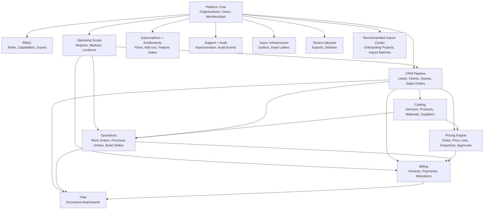
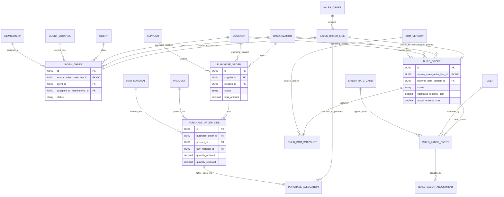
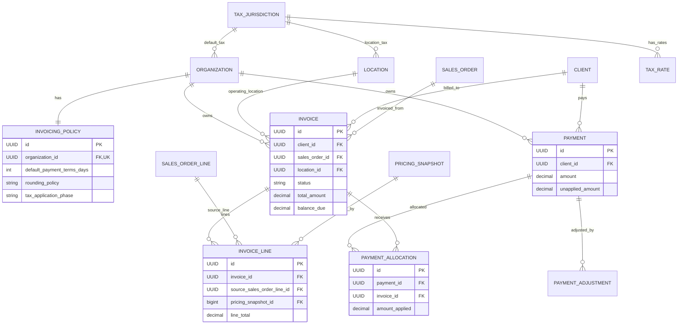
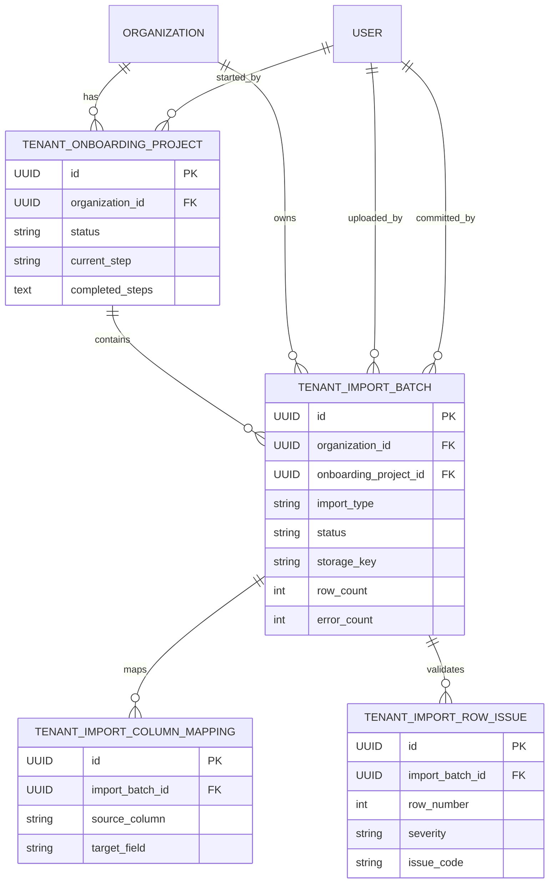
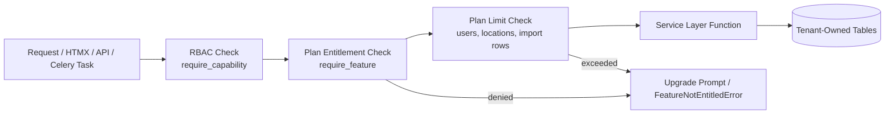

# MyPipelineHero CRM — Database Model Diagram Package

**Purpose:** Relationship-focused database model diagrams for the MyPipelineHero CRM, based on the uploaded Technical Development Guide and the Tier Subscriptions / Feature Mapping document.

**How to read this file:**

- The diagrams use GitHub-compatible Mermaid `erDiagram` syntax. Attribute key markers are limited to Mermaid-supported `PK`, `FK`, and `UK`.
- Diagrams are split by bounded context because one single ERD would be too large to use.
- Most tenant-owned tables include `organization_id`. To reduce visual noise, the diagrams still show the most important `Organization` relationships, but the rule remains: **every tenant-owned model belongs to one Organization unless explicitly platform-level.**
- Join/link tables are shown explicitly because they are important to the design.
- Enum-like concepts such as `PlanCode`, `AddOnCode`, and `FeatureCode` are shown as conceptual registry nodes where useful even if implemented as Django `TextChoices` instead of standalone tables.

---

## 1. Legend

```text
||--||  one-to-one
||--o{  one-to-many
o{--o{  many-to-many through a join/link table
```

Common conventions:

```text
PK = primary key
FK = foreign key
UK = unique key or unique constraint
```

---

## 2. Bounded Context Overview



---

## 3. Platform, Tenancy, Identity, RBAC, RML, and Subscriptions

This is the foundation diagram. It combines the guide's tenancy/RBAC model with the tier package subscription and add-on model.

```mermaid
erDiagram
    USER ||--o{ MEMBERSHIP : has
    ORGANIZATION ||--o{ MEMBERSHIP : has
    ORGANIZATION ||--o{ REGION : owns
    REGION ||--o{ MARKET : contains
    MARKET ||--o{ LOCATION : contains
    TAX_JURISDICTION ||--o{ LOCATION : default_for

    MEMBERSHIP ||--o{ MEMBERSHIP_ROLE : assigned
    ROLE ||--o{ MEMBERSHIP_ROLE : grants
    ROLE ||--o{ ROLE_CAPABILITY : includes
    CAPABILITY ||--o{ ROLE_CAPABILITY : included_in
    MEMBERSHIP ||--o{ MEMBERSHIP_CAPABILITY_GRANT : override
    CAPABILITY ||--o{ MEMBERSHIP_CAPABILITY_GRANT : overridden

    MEMBERSHIP ||--o{ MEMBERSHIP_SCOPE_ASSIGNMENT : scoped_by
    REGION ||--o{ MEMBERSHIP_SCOPE_ASSIGNMENT : region_scope
    MARKET ||--o{ MEMBERSHIP_SCOPE_ASSIGNMENT : market_scope
    LOCATION ||--o{ MEMBERSHIP_SCOPE_ASSIGNMENT : location_scope

    USER ||--o{ EXTERNAL_IDENTITY : authenticates_with
    OAUTH_PROVIDER_CONFIG ||--o{ EXTERNAL_IDENTITY : provider
    HANDOFF_SIGNING_KEY ||--o{ AUDIT_EVENT : rotates_audited_by

    ORGANIZATION ||--|| SUBSCRIPTION : has
    ORGANIZATION ||--o{ ORGANIZATION_ADD_ON_SUBSCRIPTION : buys
    ORGANIZATION ||--o{ ORGANIZATION_ENTITLEMENT_OVERRIDE : overrides
    PLAN_CODE ||--o{ SUBSCRIPTION : selected_by
    PLAN_CODE ||--o{ PLAN_ENTITLEMENT : enables
    ADD_ON_CODE ||--o{ ORGANIZATION_ADD_ON_SUBSCRIPTION : purchased_as
    ADD_ON_CODE ||--o{ PLAN_ADD_ON_ENTITLEMENT : enables
    FEATURE_CODE ||--o{ PLAN_ENTITLEMENT : feature
    FEATURE_CODE ||--o{ PLAN_ADD_ON_ENTITLEMENT : feature
    FEATURE_CODE ||--o{ ORGANIZATION_ENTITLEMENT_OVERRIDE : feature

    USER ||--o{ IMPERSONATION_AUDIT_LOG : support_user
    USER ||--o{ IMPERSONATION_AUDIT_LOG : target_user
    MEMBERSHIP ||--o{ IMPERSONATION_AUDIT_LOG : target_membership
    ORGANIZATION ||--o{ IMPERSONATION_AUDIT_LOG : tenant

    USER {
      UUID id PK
      string email UK
      boolean is_staff
      boolean is_superuser
      boolean is_system
    }
    ORGANIZATION {
      UUID id PK
      string slug UK
      string name
      string status
      string timezone
      string base_currency_code
      boolean org_setup_complete
    }
    MEMBERSHIP {
      UUID id PK
      UUID user_id FK
      UUID organization_id FK
      string status
      string invitation_token_hash
    }
    ROLE {
      UUID id PK
      UUID organization_id FK
      string code
      boolean is_default
      boolean is_scoped_role
    }
    CAPABILITY {
      UUID id PK
      string code UK
      string category
    }
    SUBSCRIPTION {
      UUID id PK
      UUID organization_id FK,UK
      string plan_code
      string status
      int included_seats
      int max_users
      int max_locations
    }
    ORGANIZATION_ADD_ON_SUBSCRIPTION {
      UUID id PK
      UUID organization_id FK
      string add_on_code
      string status
    }
```



### 3.1 Notes

- `Organization` is the tenant root.
- `User` is global; tenant access is through `Membership`.
- RBAC is user-within-tenant through `Membership -> MembershipRole -> Role -> RoleCapability -> Capability`.
- Operating scope is `Region -> Market -> Location`, assigned to memberships through `MembershipScopeAssignment`.
- Subscription entitlements are tenant-level. RBAC answers “can this user do it?” while entitlements answer “did this tenant pay for it?”
- Plan and add-on entitlements should be enforced through `require_feature(...)` in the service layer.

---

## 4. CRM Pipeline: Leads, Clients, Quotes, Sales Orders, Tasks, Communications

```mermaid
erDiagram
    ORGANIZATION ||--o{ LEAD : owns
    LOCATION ||--o{ LEAD : operating_location
    MEMBERSHIP ||--o{ LEAD : owner
    LEAD ||--o{ LEAD_CONTACT : has
    LEAD ||--o{ LEAD_LOCATION : has_sites

    ORGANIZATION ||--o{ CLIENT : owns
    LOCATION ||--o{ CLIENT : operating_location
    CUSTOMER_SEGMENT ||--o{ CLIENT : segment
    CLIENT ||--o{ CLIENT_CONTACT : has
    CLIENT ||--o{ CLIENT_LOCATION : has

    ORGANIZATION ||--o{ QUOTE : owns
    LOCATION ||--o{ QUOTE : operating_location
    LEAD ||--o{ QUOTE : source_lead
    CLIENT ||--o{ QUOTE : for_client
    QUOTE ||--o{ QUOTE_VERSION : versions
    USER ||--o{ QUOTE_VERSION : sent_by
    USER ||--o{ QUOTE_VERSION : accepted_by
    QUOTE_VERSION ||--o{ QUOTE_VERSION_LINE : lines
    QUOTE_VERSION ||--o{ QUOTE_VERSION_DISCOUNT : discounts
    SERVICE ||--o{ QUOTE_VERSION_LINE : service_line
    PRODUCT ||--o{ QUOTE_VERSION_LINE : product_line
    BUNDLE_DEFINITION ||--o{ QUOTE_VERSION_LINE : bundle_line
    SUPPLIER ||--o{ QUOTE_VERSION_LINE : selected_supplier
    BOM_VERSION ||--o{ QUOTE_VERSION_LINE : selected_bom
    PRICING_SNAPSHOT ||--o{ QUOTE_VERSION_LINE : priced_by
    PRICING_APPROVAL ||--o{ QUOTE_VERSION_LINE : pending_approval

    CLIENT ||--o{ SALES_ORDER : places
    LOCATION ||--o{ SALES_ORDER : operating_location
    QUOTE_VERSION ||--|| SALES_ORDER : accepted_into
    SALES_ORDER ||--o{ SALES_ORDER_LINE : contains
    QUOTE_VERSION_LINE ||--|| SALES_ORDER_LINE : copied_from
    SALES_ORDER_LINE ||--o{ SALES_ORDER_LINE : bundle_children
    PRICING_SNAPSHOT ||--o{ SALES_ORDER_LINE : snapshot

    ORGANIZATION ||--o{ TASK : owns
    MEMBERSHIP ||--o{ TASK : assigned_to
    TASK ||--o{ TASK_LINK : links
    LEAD ||--o{ TASK_LINK : linked_lead
    QUOTE ||--o{ TASK_LINK : linked_quote
    CLIENT ||--o{ TASK_LINK : linked_client
    SALES_ORDER ||--o{ TASK_LINK : linked_order
    WORK_ORDER ||--o{ TASK_LINK : linked_work_order
    BUILD_ORDER ||--o{ TASK_LINK : linked_build_order
    PURCHASE_ORDER ||--o{ TASK_LINK : linked_purchase_order
    INVOICE ||--o{ TASK_LINK : linked_invoice

    ORGANIZATION ||--o{ COMMUNICATION : owns
    COMMUNICATION ||--o{ COMMUNICATION_LINK : links
    LEAD ||--o{ COMMUNICATION_LINK : linked_lead
    QUOTE ||--o{ COMMUNICATION_LINK : linked_quote
    CLIENT ||--o{ COMMUNICATION_LINK : linked_client
    SALES_ORDER ||--o{ COMMUNICATION_LINK : linked_order
    WORK_ORDER ||--o{ COMMUNICATION_LINK : linked_work_order
    BUILD_ORDER ||--o{ COMMUNICATION_LINK : linked_build_order
    PURCHASE_ORDER ||--o{ COMMUNICATION_LINK : linked_purchase_order
    INVOICE ||--o{ COMMUNICATION_LINK : linked_invoice

    LEAD {
      UUID id PK
      UUID organization_id FK
      UUID location_id FK
      string number UK
      string status
      UUID owner_membership_id FK
    }
    CLIENT {
      UUID id PK
      UUID organization_id FK
      UUID location_id FK
      string number UK
      string display_name
      string status
      UUID customer_segment_id FK
    }
    QUOTE {
      UUID id PK
      UUID organization_id FK
      UUID location_id FK
      string number UK
      UUID lead_id FK
      UUID client_id FK
    }
    QUOTE_VERSION {
      UUID id PK
      UUID quote_id FK
      int version_number
      string status
      decimal total_amount
    }
    QUOTE_VERSION_LINE {
      UUID id PK
      UUID quote_version_id FK
      string line_type
      decimal quantity
      bigint pricing_snapshot_id FK
    }
    SALES_ORDER {
      UUID id PK
      UUID client_id FK
      UUID originating_quote_version_id FK
      string status
      decimal total_amount
    }
    SALES_ORDER_LINE {
      UUID id PK
      UUID sales_order_id FK
      UUID source_quote_version_line_id FK
      string line_type
      string fulfillment_status
    }
```



### 4.1 Commercial flow represented by the tables

```text
Lead -> Quote -> QuoteVersion -> QuoteVersionLine -> PricingSnapshot
Sent QuoteVersion -> Accepted QuoteVersion -> SalesOrder -> SalesOrderLine
SalesOrderLine -> WorkOrder / PurchaseOrder / BuildOrder depending on line type
SalesOrder -> Invoice -> PaymentAllocation -> Payment
```

---

## 5. Catalog and Pricing

```mermaid
erDiagram
    ORGANIZATION ||--o{ SERVICE_CATEGORY : owns
    SERVICE_CATEGORY ||--o{ SERVICE : categorizes
    ORGANIZATION ||--o{ SERVICE : owns
    ORGANIZATION ||--o{ PRODUCT : owns
    ORGANIZATION ||--o{ RAW_MATERIAL : owns
    ORGANIZATION ||--o{ SUPPLIER : owns
    SUPPLIER ||--o{ SUPPLIER_PRODUCT : supplies
    PRODUCT ||--o{ SUPPLIER_PRODUCT : supplied_product
    RAW_MATERIAL ||--o{ SUPPLIER_PRODUCT : supplied_material

    PRODUCT ||--|| BOM : has_if_manufactured
    BOM ||--o{ BOM_VERSION : versions
    BOM_VERSION ||--o{ BOM_LINE : has
    RAW_MATERIAL ||--o{ BOM_LINE : consumes

    ORGANIZATION ||--o{ CUSTOMER_SEGMENT : defines
    ORGANIZATION ||--o{ PRICING_RULE : defines
    CLIENT ||--o{ PRICING_RULE : targets_client
    CUSTOMER_SEGMENT ||--o{ PRICING_RULE : targets_segment
    REGION ||--o{ PRICING_RULE : targets_region
    MARKET ||--o{ PRICING_RULE : targets_market
    LOCATION ||--o{ PRICING_RULE : targets_location
    SUPPLIER ||--o{ PRICING_RULE : targets_supplier

    ORGANIZATION ||--o{ PRICE_LIST : owns
    PRICE_LIST ||--o{ PRICE_LIST_ITEM : contains
    SERVICE ||--o{ PRICE_LIST_ITEM : service_price
    PRODUCT ||--o{ PRICE_LIST_ITEM : product_price
    BUNDLE_DEFINITION ||--o{ PRICE_LIST_ITEM : bundle_price
    CLIENT ||--o{ CLIENT_CONTRACT_PRICING : has_contract
    PRICE_LIST ||--o{ CLIENT_CONTRACT_PRICING : contract_uses

    ORGANIZATION ||--o{ LABOR_RATE_CARD : owns
    LABOR_RATE_CARD ||--o{ LABOR_RATE_CARD_LINE : rates

    ORGANIZATION ||--o{ PROMOTION_CAMPAIGN : owns
    PROMOTION_CAMPAIGN ||--o{ PROMOTION_USAGE : used_by
    CLIENT ||--o{ PROMOTION_USAGE : client_usage
    QUOTE_VERSION ||--o{ PROMOTION_USAGE : quote_usage

    ORGANIZATION ||--o{ BUNDLE_DEFINITION : owns
    BUNDLE_DEFINITION ||--o{ BUNDLE_COMPONENT : components
    SERVICE ||--o{ BUNDLE_COMPONENT : service_component
    PRODUCT ||--o{ BUNDLE_COMPONENT : product_component

    QUOTE_VERSION ||--o{ PRICING_APPROVAL : needs
    QUOTE_VERSION_LINE ||--o{ PRICING_APPROVAL : line_approval
    USER ||--o{ PRICING_APPROVAL : requested_by
    USER ||--o{ PRICING_APPROVAL : decided_by
    PRICING_APPROVAL ||--o{ PRICING_SNAPSHOT : approval_snapshot
    QUOTE_VERSION_LINE ||--o{ PRICING_SNAPSHOT : quote_line_snapshot
    INVOICE_LINE ||--o{ PRICING_SNAPSHOT : invoice_line_snapshot

    SERVICE {
      UUID id PK
      UUID organization_id FK
      UUID category_id FK
      string code UK
      decimal catalog_price
      string default_pricing_strategy_code
    }
    PRODUCT {
      UUID id PK
      UUID organization_id FK
      string code UK
      string product_type
      string default_pricing_strategy_code
    }
    RAW_MATERIAL {
      UUID id PK
      UUID organization_id FK
      string code UK
      decimal current_cost
    }
    SUPPLIER_PRODUCT {
      UUID id PK
      UUID supplier_id FK
      UUID product_id FK
      UUID raw_material_id FK
      decimal cost
    }
    BOM_VERSION {
      UUID id PK
      UUID bom_id FK
      int version_number
      string status
      date effective_from
    }
    PRICING_SNAPSHOT {
      bigint id PK
      UUID organization_id FK
      UUID quote_version_line_id FK
      UUID invoice_line_id FK
      string engine_version
      string strategy_code
      decimal effective_line_total
    }
```



### 5.1 Pricing engine relationship notes

- `PricingSnapshot` is immutable and is the quote-time/invoice-time pricing truth.
- `PricingRule`, `PriceList`, `ClientContractPricing`, `LaborRateCard`, `CustomerSegment`, `PromotionCampaign`, and `BundleDefinition` are pricing configuration tables.
- `QuoteVersionLine` references the selected catalog item and the resulting `PricingSnapshot`.
- `SalesOrderLine` copies commercial values from `QuoteVersionLine` and keeps the snapshot reference.
- `InvoiceLine` also references a pricing snapshot so billing history remains reproducible.

---

## 6. Operations and Fulfillment



### 6.1 Fulfillment dispatch rule

```text
SalesOrderLine.line_type = SERVICE               -> WorkOrder
SalesOrderLine.line_type = RESALE_PRODUCT        -> PurchaseOrder is operator-driven, linked by PurchaseAllocation
SalesOrderLine.line_type = MANUFACTURED_PRODUCT  -> BuildOrder
SalesOrderLine.line_type = BUNDLE                -> decomposes into child SalesOrderLines from snapshot
```

---

## 7. Billing, Invoicing, and Payments



---

## 8. Files, Typed Links, Reporting, Audit, Outbox, and Tenant Lifecycle

```mermaid
erDiagram
    ORGANIZATION ||--o{ DOCUMENT_ATTACHMENT : owns
    USER ||--o{ DOCUMENT_ATTACHMENT : uploaded_by
    DOCUMENT_ATTACHMENT ||--o{ DOCUMENT_ATTACHMENT_LINK : links
    LEAD ||--o{ DOCUMENT_ATTACHMENT_LINK : linked_lead
    QUOTE_VERSION ||--o{ DOCUMENT_ATTACHMENT_LINK : linked_quote_version
    CLIENT ||--o{ DOCUMENT_ATTACHMENT_LINK : linked_client
    SALES_ORDER ||--o{ DOCUMENT_ATTACHMENT_LINK : linked_order
    WORK_ORDER ||--o{ DOCUMENT_ATTACHMENT_LINK : linked_work_order
    BUILD_ORDER ||--o{ DOCUMENT_ATTACHMENT_LINK : linked_build_order
    PURCHASE_ORDER ||--o{ DOCUMENT_ATTACHMENT_LINK : linked_purchase_order
    INVOICE ||--o{ DOCUMENT_ATTACHMENT_LINK : linked_invoice
    COMMUNICATION ||--o{ DOCUMENT_ATTACHMENT_LINK : linked_communication

    ORGANIZATION ||--o{ AUDIT_EVENT : audited
    USER ||--o{ AUDIT_EVENT : actor
    USER ||--o{ AUDIT_EVENT : on_behalf_of

    ORGANIZATION ||--o{ OUTBOX_ENTRY : emits
    OUTBOX_ENTRY ||--o{ OUTBOX_DEAD_LETTER : failed_to

    ORGANIZATION ||--o{ ENTITY_NUMBER_SEQUENCE : sequences
    ORGANIZATION ||--o{ REPORT_EXPORT_JOB : exports
    USER ||--o{ REPORT_EXPORT_JOB : requested_by
    DOCUMENT_ATTACHMENT ||--o{ REPORT_EXPORT_JOB : output_file

    ORGANIZATION ||--o{ TENANT_EXPORT_REQUEST : export_requests
    USER ||--o{ TENANT_EXPORT_REQUEST : requested_by
    DOCUMENT_ATTACHMENT ||--o{ TENANT_EXPORT_REQUEST : output_archive
    ORGANIZATION ||--o{ TENANT_DELETION_REQUEST : deletion_requests
    USER ||--o{ TENANT_DELETION_REQUEST : requested_by

    DOCUMENT_ATTACHMENT {
      UUID id PK
      UUID organization_id FK
      string document_kind
      string storage_key
      string visibility
      string malware_scan_status
    }
    AUDIT_EVENT {
      bigint id PK
      UUID organization_id FK
      UUID actor_id FK
      string event_type
      string event_category
      timestamptz event_at
    }
    OUTBOX_ENTRY {
      bigint id PK
      UUID organization_id FK
      string topic
      string idempotency_key UK
      string status
    }
    ENTITY_NUMBER_SEQUENCE {
      bigint id PK
      UUID organization_id FK
      string entity_kind
      int year
      bigint next_value
    }
```



### 8.1 Typed link rule

`TaskLink`, `CommunicationLink`, and `DocumentAttachmentLink` intentionally avoid generic foreign keys. Each link table has nullable explicit FKs and a check constraint requiring exactly one linked target.

---

## 9. Recommended Tenant Onboarding / Import Center Extension

The uploaded guide includes tenant setup and tenant lifecycle tables. The following import-center tables reflect the recommended onboarding/import extension from the design discussion. Mark this section as an **additive recommendation** if the guide has not yet been updated with these models.



### 9.1 Import Center writes through domain services

```text
TenantImportBatch COMMITTED -> calls service-layer functions only
Location imports -> Region / Market / Location
Staff imports -> Membership INVITED + MembershipRole + MembershipScopeAssignment
Catalog imports -> Service / Product / RawMaterial / Supplier / SupplierProduct / BOM
Client imports -> Client / ClientContact / ClientLocation
Lead imports -> Lead / LeadContact / LeadLocation
```

---

## 10. Tier Package Feature Gates to Model Groups

This table maps the tier-package feature codes to the database tables they primarily unlock or limit.

| Feature Code | Primary Tables / Models Affected | Notes |
|---|---|---|
| `leads` | `Lead`, `LeadContact`, `LeadLocation` | Base CRM feature |
| `clients` | `Client`, `ClientContact`, `ClientLocation` | Base CRM feature |
| `tasks` | `Task`, `TaskLink` | Base productivity feature |
| `communications` | `Communication`, `CommunicationLink` | Base activity/history feature |
| `basic_catalog` | `ServiceCategory`, `Service`, `Product` | Starter-safe catalog |
| `basic_quotes` | `Quote`, `QuoteVersion`, `QuoteVersionLine`, `QuoteVersionDiscount`, `PricingSnapshot` | Basic quoting still uses snapshots |
| `basic_invoicing` | `Invoice`, `InvoiceLine`, `Payment`, `PaymentAllocation` | Refunds/credit notes remain out of scope |
| `standard_reports` | `ReportExportJob`, report query services | Fixed reports and exports |
| `import_center` | `TenantOnboardingProject`, `TenantImportBatch`, mappings/issues | Limited by row count per plan |
| `multi_location` | `Region`, `Market`, `Location` | Starter may have location count limits |
| `rml_scope` | `MembershipScopeAssignment`, scoped querysets | Controls access by Region/Market/Location |
| `sales_orders` | `SalesOrder`, `SalesOrderLine` | Limited/basic in Starter if desired |
| `work_orders` | `WorkOrder` | Growth or Work Orders add-on |
| `purchase_orders` | `PurchaseOrder`, `PurchaseOrderLine`, `PurchaseAllocation` | Growth or Purchasing add-on |
| `price_lists` | `PriceList`, `PriceListItem` | Growth or Advanced Pricing add-on |
| `client_contract_pricing` | `ClientContractPricing` | Growth or Advanced Pricing add-on |
| `customer_segments` | `CustomerSegment` | Basic default segment may exist for all tenants |
| `tax_rates` | `TaxJurisdiction`, `TaxRate` | Basic tax required for onboarding |
| `labor_rate_cards` | `LaborRateCard`, `LaborRateCardLine`, `BuildLaborEntry` | Limited in Growth, full in Pro |
| `advanced_pricing_rules` | `PricingRule` | Growth limited, Pro full |
| `manual_price_overrides` | `QuoteVersionLine`, `PricingSnapshot`, `PricingApproval` | Approval may be Pro-only |
| `pricing_approvals` | `PricingApproval` | Pro/Enterprise only |
| `bundles` | `BundleDefinition`, `BundleComponent`, bundle quote/order lines | Basic add-on may exclude configurable bundles |
| `configurable_bundles` | `BundleDefinition`, `BundleComponent`, `QuoteVersionLine.selected_options_json` | Pro/Enterprise only |
| `promotions` | `PromotionCampaign`, `PromotionUsage` | Pro/Enterprise only |
| `raw_materials` | `RawMaterial` | Growth limited, Pro full |
| `suppliers` | `Supplier` | Growth+ or Purchasing add-on |
| `supplier_costs` | `SupplierProduct` | Growth+ or Purchasing add-on |
| `bom_manufacturing` | `BOM`, `BOMVersion`, `BOMLine`, manufactured `Product` quoting | Pro/Enterprise only |
| `bom_versioning` | `BOMVersion`, `BOMLine` | Pro/Enterprise only |
| `build_orders` | `BuildOrder`, `BuildBOMSnapshot` | Pro/Enterprise only |
| `build_labor_tracking` | `BuildLaborEntry`, `BuildLaborAdjustment` | Pro/Enterprise only |
| `build_cost_variance` | `BuildOrder` estimated/actual cost fields | Pro/Enterprise only |
| `advanced_reporting` | `ReportExportJob`, report services | Growth limited, Pro full |
| `tenant_export` | `TenantExportRequest`, `DocumentAttachment` | All plans, possibly limited by support policy |
| `tenant_deletion` | `TenantDeletionRequest` | All plans |
| `entitlement_overrides` | `OrganizationEntitlementOverride` | Enterprise/support-only |
| `custom_import_mapping` | `TenantImportColumnMapping`, support migration tooling | Add-on/Enterprise |

---

## 11. Entitlement Enforcement Relationship



Recommended precedence:

```text
1. OrganizationEntitlementOverride
2. PlanEntitlement
3. PlanAddOnEntitlement through active OrganizationAddOnSubscription
4. Deny
```

---

## 12. Master Model Index

| Domain | Models |
|---|---|
| Platform identity | `User`, `ExternalIdentity`, `OAuthProviderConfig`, `HandoffSigningKey` |
| Tenant core | `Organization`, `Membership`, `Region`, `Market`, `Location`, `MembershipScopeAssignment` |
| RBAC | `Capability`, `Role`, `RoleCapability`, `MembershipRole`, `MembershipCapabilityGrant` |
| Subscriptions / tiers | `Subscription`, `PlanEntitlement`, `PlanAddOnEntitlement`, `OrganizationAddOnSubscription`, `OrganizationEntitlementOverride` |
| Support | `ImpersonationAuditLog` |
| Leads | `Lead`, `LeadContact`, `LeadLocation` |
| Clients | `Client`, `ClientContact`, `ClientLocation` |
| Quotes | `Quote`, `QuoteVersion`, `QuoteVersionLine`, `QuoteVersionDiscount` |
| Sales orders | `SalesOrder`, `SalesOrderLine` |
| Tasks | `Task`, `TaskLink` |
| Communications | `Communication`, `CommunicationLink` |
| Files | `DocumentAttachment`, `DocumentAttachmentLink` |
| Catalog | `ServiceCategory`, `Service`, `Product`, `RawMaterial`, `Supplier`, `SupplierProduct` |
| Manufacturing catalog | `BOM`, `BOMVersion`, `BOMLine` |
| Pricing | `PricingRule`, `PriceList`, `PriceListItem`, `ClientContractPricing`, `LaborRateCard`, `LaborRateCardLine`, `CustomerSegment`, `PromotionCampaign`, `PromotionUsage`, `BundleDefinition`, `BundleComponent`, `PricingApproval`, `PricingSnapshot` |
| Tax | `TaxJurisdiction`, `TaxRate` |
| Fulfillment | `WorkOrder`, `PurchaseOrder`, `PurchaseOrderLine`, `PurchaseAllocation`, `BuildOrder`, `BuildBOMSnapshot`, `BuildLaborEntry`, `BuildLaborAdjustment` |
| Billing | `InvoicingPolicy`, `Invoice`, `InvoiceLine`, `Payment`, `PaymentAllocation`, `PaymentAdjustment` |
| Audit / async | `AuditEvent`, `OutboxEntry`, `OutboxDeadLetter` |
| Numbering | `EntityNumberSequence` |
| Reporting | `ReportExportJob` |
| Tenant lifecycle | `TenantExportRequest`, `TenantDeletionRequest` |
| Recommended onboarding import extension | `TenantOnboardingProject`, `TenantImportBatch`, `TenantImportColumnMapping`, `TenantImportRowIssue` |

---

## 13. Implementation Notes for Django

1. Keep `Organization` as the tenant boundary for every tenant-owned table.
2. Do not implement tier restrictions as template-only logic.
3. Put `require_feature(...)` inside service-layer functions that create or mutate restricted records.
4. Keep RBAC and plan entitlement separate.
5. Keep downgrade behavior read-only, not destructive.
6. Use explicit link tables instead of `GenericForeignKey`.
7. Treat `PricingSnapshot`, `AuditEvent`, `Payment`, `BuildLaborEntry`, and commercial accepted records as immutable or append-only according to the guide.
8. Keep SaaS subscription billing separate from tenant customer invoicing.
9. For early v1, let platform operators set `Subscription` and add-ons manually in the platform console.
10. Add payment-provider integration later only when self-service upgrades are intentionally in scope.

